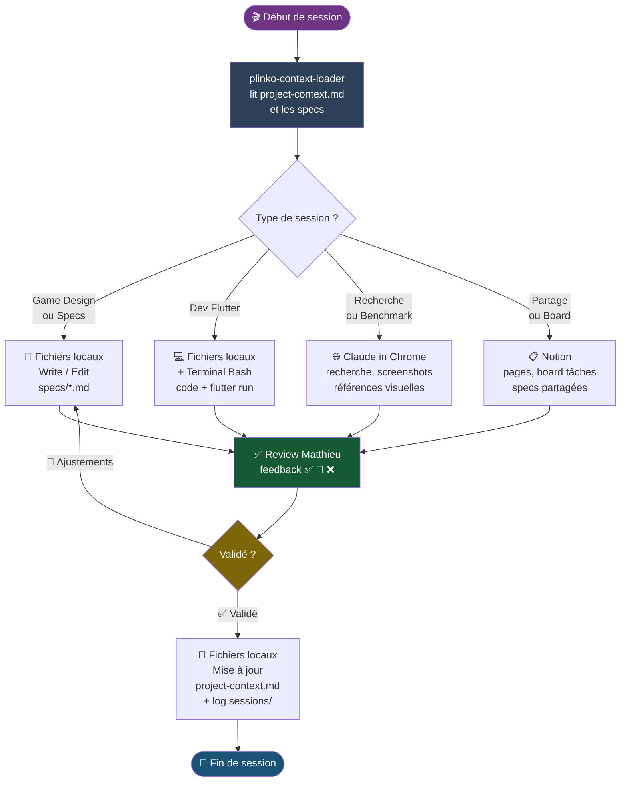

# Organisation des outils — Balleck Team
> 26 mars 2026 · Plinko Project

---

## Vue d'ensemble

Claude dispose de plusieurs catégories d'outils. Tous ne sont pas utiles à chaque session — ce document explique à quoi sert chaque outil, quand l'utiliser, et comment ils s'articulent dans notre workflow.

---

## Les outils par catégorie

### 1. Fichiers locaux
**Outils :** Read, Write, Edit, Bash (ls, cp, mv…)
**Rôle :** Lire, créer et modifier les fichiers directement dans le dossier Plinko sur ta machine.
**On l'utilise pour :** specs, code Flutter, logs de session, project-context.md, assets.
**Concrètement :** c'est le moteur principal de chaque session — chaque décision finit en fichier.

---

### 2. Terminal / Bash
**Outil :** Bash (commandes système)
**Rôle :** Exécuter des commandes sur ta machine dans le terminal.
**On l'utilise pour :**
- `flutter run` — lancer l'app sur un device ou simulateur
- `flutter build` — compiler l'app
- `flutter pub add flame` — ajouter un package
- `git commit / push` — versionner le code
- Scripts de test ou d'automatisation

**Concrètement :** tout ce qu'on ferait dans un terminal, Claude peut le faire à ta place.

---

### 3. Notion
**Outils :** notion-fetch, notion-create-pages, notion-update-page, notion-search…
**Rôle :** Lire et écrire dans tes espaces Notion.
**On l'utilise pour :**
- Board de tâches / suivi d'avancement visible hors Cowork
- Specs partagées avec un client ou partenaire
- Inspirations et références organisées
- Notes de réunion ou briefs partagés

**Concrètement :** si les fichiers locaux sont notre cockpit de travail, Notion est la vitrine — ce qu'on partage vers l'extérieur ou ce qu'on veut consulter depuis n'importe où.

> ⚠️ Pour le MVP, on travaille en fichiers locaux. Notion sera activé quand on aura besoin de partager ou d'organiser à plus grande échelle.

---

### 4. Claude in Chrome
**Outils :** navigate, read_page, screenshot (computer), get_page_text…
**Rôle :** Piloter un vrai navigateur web — ouvrir des pages, lire du contenu, capturer des visuels.
**On l'utilise pour :**
- Benchmark de jeux Plinko concurrents
- Recherche de références visuelles / design inspiration
- Lire la documentation Flutter ou Flame
- Trouver des packages, lire des changelogs

**Concrètement :** c'est comme demander à quelqu'un de faire une recherche sur le web et de te ramener les infos structurées. Très utile pour les sessions de recherche ou de design.

---

### 5. Skills
**Outil :** système de skills Cowork
**Rôle :** Des workflows pré-configurés qui se déclenchent automatiquement selon le contexte.
**Skills actifs sur ce projet :**
- `plinko-context-loader` → charge le project-context et les specs au démarrage de chaque session

**On peut en créer d'autres pour :** automatiser la création d'un log de session, générer un rapport de build, etc.

---

### 6. Tâches planifiées
**Outil :** scheduled-tasks
**Rôle :** Déclencher une action automatiquement à intervalles réguliers.
**Exemples d'usage potentiel :**
- Rappel quotidien de mise à jour du project-context.md
- Vérification automatique de la cohérence des fichiers du projet

> Non utilisé pour le moment. À activer si le besoin se présente.

---

### 7. Connecteurs & Plugins (MCP Registry)
**Outils :** search_mcp_registry, suggest_connectors, search_plugins
**Rôle :** Trouver et connecter de nouveaux services tiers.
**Exemples post-MVP :** GitHub (versionner le code), Figma (récupérer les designs), Slack (notifier l'équipe d'un build réussi).

> Non utilisé pour le MVP. On activera ce dont on a besoin au fil des besoins.

---

## Schéma de workflow

---

## Résumé rapide

| Outil | Phase | Fréquence |
|---|---|---|
| **plinko-context-loader** | Démarrage | Systématique |
| **Fichiers locaux** | Toutes sessions | Systématique |
| **Terminal / Bash** | Dev sessions | Sessions dev |
| **Claude in Chrome** | Recherche / Design | Ponctuel |
| **Notion** | Partage / Board | Post-MVP ou si besoin |
| **Skills** | Automatisation | Au fur et à mesure |
| **Tâches planifiées** | Automatisation récurrente | Si besoin |
| **MCP / Plugins** | Nouvelles intégrations | Post-MVP |

---

*Dernière mise à jour : 2026-03-26*
